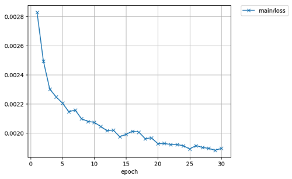

# U-Netによる音楽と音声のミックス信号（モノラル）からの音声の分離  

## 概要  

U型のネットワーク構造をもつU-Netを使って音楽のボーカル部分を分離する記事があった。 
そこで、音楽と相関のない音声をミックスしたモノラル信号から音声部分を抜き出す実験をしてみた。 
バックに音楽が流れていて、そこから音声だけを抽出するような場面を想定している。  
wuyiming氏が公開している [UNet-VocalSeparation-Chainer](https://github.com/Xiao-Ming/UNet-VocalSeparation-Chainer) を
参考にして作り直したものである。  

[github repository](https://github.com/shun60s/Blind-Speech-Separation)  

## 使い方  

### 学習用の音楽と音声のデータを準備する    

学習用に  [GTZAN music/speech collection](http://marsyasweb.appspot.com/download/data_sets/) から
music_speech.tar.gz をダウンロードして、music_speechディレクトリーの以下のmusic_wavとspeech_wavに展開する。  

```
python3 make_dataset.py
```
音楽（music)と音声(speech)をミックスした信号（サンプリングレート16KHz、モノラル）を作成し、短時間フーリエ変換を計算する。  

### U-Netを更に学習する  

U-Netのモデル初期値としてunet.modelを [UNet-VocalSeparation-Chainer](https://github.com/Xiao-Ming/UNet-VocalSeparation-Chainer) から
ダウンロードして使う。train.pyと同じディレクトリーに置く。  
このunet.modelを使っても　おおむね分離できるが、GTZAN music/speech collectionを使って学習してみる。  
```
python3 train.py
```
 下図は学習過程の損失の変化のグラフ。学習データはすべて訓練用に利用する。テストはなし。 
  

GPU(引数に -g 0）でメモリー不足エラーがでる場合、バッチサイズを小さくする（例えば引数に　-b 32　を指定する）と動くかもしれない。  


### 音楽と音声のミックス信号から音声を分離する  

入出ファイル（又は、ディレクトリー）とU-Netの計算に使うモデルファイルを指定する。  

例１　UNet-VocalSeparation-Chainerのunet.modelを使って分離する。
```
python3 make_separate.py  -i mixed_input.wav -o separeted_output.wav -m unet.model
```
出力は、サンプリングレート16KHz、モノラルのwavファイルになる。 

例2　学習結果のモデルファイルmodel_420を使って　ディレクトリーの中にあるwavファイルを分離する。
```
python3 make_separate.py  -i mixdown -o separate -m result/model_420
```
## 感想  

単にイコライザーをかけて音楽成分を目立たなくした様なものもあれば、
音楽信号の方が大きいため？分離しても音声の明瞭度がかなり落ちている部分もある。  
聞き比べた結果、unet.modelを使ったほうが多少音質がまとものように感じた。  
学習データとは云えかなり分離できているものもある。不思議なことである。  

(mixdownとseparateディレクトリーにの中にミックスしたもと信号と分離したもののサンプルが有ります。)  

## ディレクトリーの説明  

- music_speech　 音楽と音声、長さ30秒のサンプルが　music_wavとspeech_wavにそれぞれ60個入れる。モノラル。
- mixdown　上記の音楽と音声をミックスしたもの。サンプリングレートは今回のU-Netモデルに合わせて16KHｚに変換してある。
- stft  上記を短時間フーリエ変換したもの。
- result ChainerによるU-Netの学習経過。エポック毎のmodel,snapshotとlogなど。
- separate ミックスした信号から　音声の分離を試みたもの。

## 参照したもの  

- [U-NetによるVocal SeparationのChainerの実装](https://github.com/Xiao-Ming/UNet-VocalSeparation-Chainer)  
- [音楽と音声のデータ・セット](http://marsyasweb.appspot.com/download/data_sets/)  
- [Singing Voice Separation with Deep U-Net Convolutional Networks](https://ismir2017.smcnus.org/wp-content/uploads/2017/10/171_Paper.pdf)  

## 免責事項  
THE SOFTWARE IS PROVIDED "AS IS", WITHOUT WARRANTY OF ANY KIND, EXPRESS OR IMPLIED, 
INCLUDING BUT NOT LIMITED TO THE WARRANTIES OF MERCHANTABILITY, FITNESS 
FOR A PARTICULAR PURPOSE AND NONINFRINGEMENT. IN NO EVENT SHALL 
THE AUTHORS OR COPYRIGHT HOLDERS BE LIABLE FOR ANY CLAIM, DAMAGES OR OTHER LIABILITY, 
WHETHER IN AN ACTION OF CONTRACT, TORT OR OTHERWISE, ARISING FROM, 
OUT OF OR IN CONNECTION WITH THE SOFTWARE OR THE USE OR OTHER DEALINGS IN THE SOFTWARE.  
#### 上記はMITライセンスからの抜粋です。


